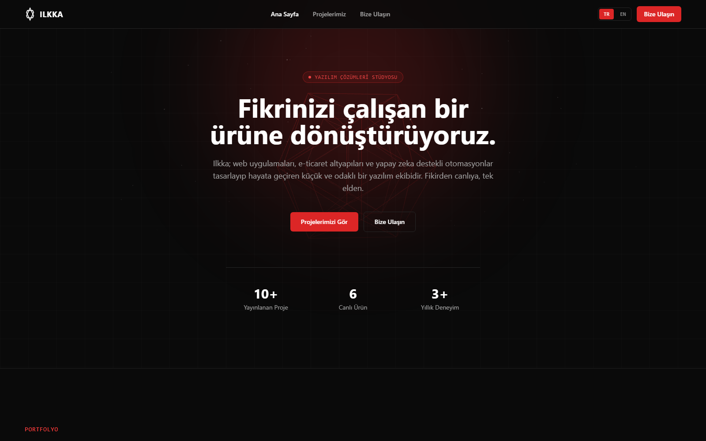

# Ilkka

*[Türkçe](README.tr.md)*

**[ilkka.vercel.app](https://ilkka.vercel.app)**



A fictional software studio landing page: "what would it look like if I started an agency?" Bilingual (TR/EN), built from scratch with Nuxt 3 as an exercise in Vue. Started life as an old Next.js "homepage template" repo full of Lorem Ipsum, rebuilt from zero.

This repo is a GitHub template, use the "Use this template" button to start your own project from it.

## Features

- **Multi-page**: Home, Projects (`/projects`), a dedicated detail page per project (`/projects/[slug]`), and Contact (`/contact`)
- **Bilingual**: instant TR/EN toggle, remembered in `localStorage`
- **3D hero scene**: a red wireframe drawn with Three.js that follows the pointer with a damped, calm motion. Never rendered on the server and never loaded under `prefers-reduced-motion`, so it can't slow down or break the first paint
- **Image/video gallery**: each project page has a full-page gallery instead of a modal

## Stack

Nuxt 3 · Vue 3 · TypeScript · Tailwind CSS · Three.js

## Development

```bash
npm install
npm run dev
```

The site opens at [http://localhost:3000](http://localhost:3000).

## Structure

- `app/pages/`: `index.vue` (home), `projects/index.vue` (portfolio), `projects/[slug].vue` (project detail), `contact.vue`
- `app/components/`: `SiteHeader`, `HeroSection`, `HeroScene.client.vue` (3D scene), `FeaturedProjects`, `ProjectsSection`, `ProjectCard`, `ContactSection`, `SiteFooter`
- `app/data/`: project and site copy (bilingual)
- `app/composables/useLocale.ts`: TR/EN language state

## Build

```bash
npm run build
```
